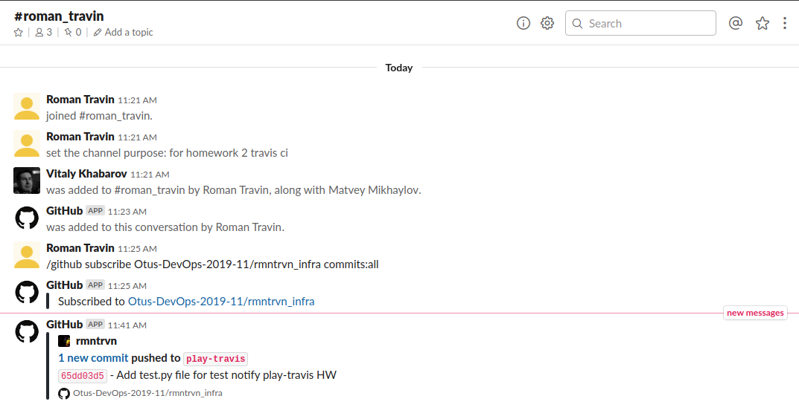

# Выполнено ДЗ № 2 "Локальное окружение инженера. ChatOps и визуализация рабочих процессов. Командная работа с Git. Работа в GitHub."
 - [x] Закрепляем знания по Git, работаем в своих репозиториях, созданных после выполнения ДЗ № 1
 - [ ] Создаем интеграцию с чатом для вашего репозитория и
подключение Travis CI

## В процессе сделано:
**1 часть задания**:
 - Клонирован [репозиторий](https://github.com/Otus-DevOps-2019-11/rmntrvn_infra)
 ```sh
 git clone https://github.com/Otus-DevOps-2019-11/rmntrvn_infra
 ```
 - Создана ветка *play-travis*
 ```sh
 cd rmntrvn_infra; git checkout -b play-travis
 ```
 - Добавлена директория *.github* и установлен шаблон для *pull request*
 ```sh
 mkdir .github; cd .github; wget http://bit.ly/otus-pr-template -O PULL_REQUEST_TEMPLATE.md
 ```
 - Установлен модуль *pre-commit* и добавлен *pre-commit*  файл
 ```sh
 pip install pre-commit
 ```
 Файл *.pre-commit-config.yaml* имеет следующее содержание:
 ```yml
 repos:
- repo: https://github.com/pre-commit/pre-commit-hooks
  rev: v2.3.0
  hooks:
  - id: end-of-file-fixer
  - id: trailing-whitespace
 ```
 - Выполнена команда инициализации *pre-commit*
 ```sh
 pre-commit install
 ```
 - Добавлены файлы в индексацию git
 ```sh
 git add PULL_REQUEST_TEMPLATE.md; git add .pre-commit-config.yaml
 ```
 - Добавлен коммит с комментарием
 ```sh
 git commit -m 'Add PR template'
 ```
 - Отправлены изменения на Github в соответствующую ветку
 ```sh
 git push --set-upstream origin play-travis
 ```
**2 часть задания**
 - Зарестрировался с [Slack-чате](https://join.slack.com/t/devops-team-otus/shared_invite/enQtMzExNjMyNzU4NTYxLWZlYzI2ZmIxZDhiYjE3YzE3MTc2YWE3MDI3N2QyZjdmODRiZGI5MmE5MmRiZjljMGExOTYwYmE5NTdjMTM0ZTE)
 - Создан канал *roman_travin*, в канал приглашены @vitkhab и @mmikhaylov
 - Установлена интеграция с Github
 ```
 /github subscribe Otus-DevOps-2019-11/rmntrvn_infra commits:all
 ```
 - Создана директория *play-travis* и в данную директорию загружен файл [test.py](https://raw.githubusercontent.com/express42/otus-snippets/master/hw-04/test.py)
 - Добавлен файл в индекцию git
 ```
 git add test.py
 ```
 - Создан коммит
 ```sh
 $ git commit -m 'Add test.py file for test notify play-travis HW'
[WARNING] Unstaged files detected.
[INFO] Stashing unstaged files to /home/rmntrvn/.cache/pre-commit/patch1576827687.
Fix End of Files.........................................................Passed
Trim Trailing Whitespace.................................................Passed
[INFO] Restored changes from /home/rmntrvn/.cache/pre-commit/patch1576827687.
[play-travis 65dd03d] Add test.py file for test notify play-travis HW
 1 file changed, 9 insertions(+)
 create mode 100644 play-travis/test.py
```
- Выполнен *push* в ветку *play-travis*
```sh
$ git push --set-upstream origin play-travis
X11 forwarding request failed on channel 0
Подсчет объектов: 4, готово.
Delta compression using up to 4 threads.
Сжатие объектов: 100% (3/3), готово.
Запись объектов: 100% (4/4), 459 bytes | 0 bytes/s, готово.
Total 4 (delta 1), reused 0 (delta 0)
remote: Resolving deltas: 100% (1/1), completed with 1 local object.
To github.com:Otus-DevOps-2019-11/rmntrvn_infra.git
   c162398..65dd03d  play-travis -> play-travis
Ветка play-travis отслеживает внешнюю ветку play-travis из origin.
```
Уведомления приходят в Slack


## Как запустить проект:
 - Например, запустить команду X в директории Y

## Как проверить работоспособность:
 - Например, перейти по ссылке http://localhost:8080

## PR checklist
 - [ ] Выставил label с номером домашнего задания
 - [ ] Выставил label с темой домашнего задания
